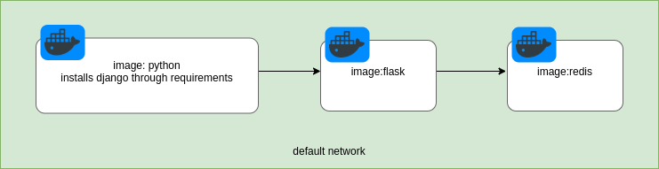

# docker-compose



<em>dummyimage.png</em>


## Volumes

To enable auto-reload one needs to make use of volumes.

Volumes will act as a reference to a local folder. keep in mind: this is different from the COPY cmd you use in Dockerfile. Volume will most likely replace what COPY has done.


### Without volume

docker-compose up

Edit your local ./project/views.py

Refresh your browser

Nothing happens

You need to docker-compose down-up.

### With volume

* docker-compose up

* Edit you local file

* Refresh your browser

* You should see your changes


### A note regarding the reference thing

With your containers running, try the following:

change any file - even outside project folder like requirements.txt

```bash
# bash into the app container
$ docker exec -it docker-compose_app_1 sh
$ cat requirements.txt

# new line added while the container was running
Django>=3.0,<4.0
psycopg2-binary>=2.8
redis==3.5.3

```

